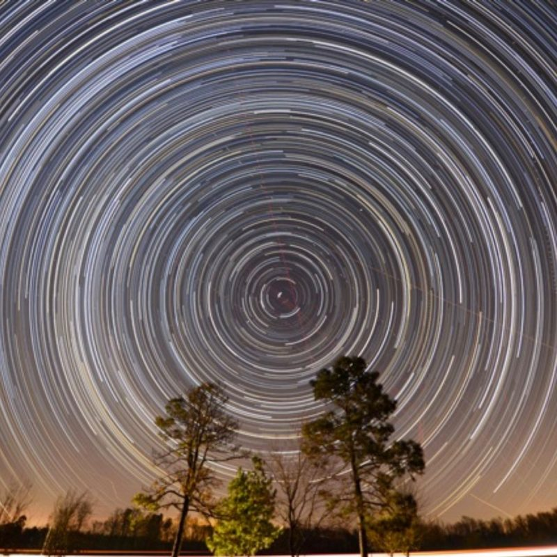

# Quiz Question

Write appropriate ROS/Python​ that continuously orientates a turtlebot to Polaris (the north star) from anywhere on Earth. Please carefully review the job description - this is a software engineering role - so it's not about maximising featureset or lines of unstructured code. Think about the use cases and how your solution might break. Show us at your best!


# Quick Solution

Because Polaris lies nearly in a direct line with the Earth's rotational axis "above" the North Pole—the north celestial pole—Polaris stands almost motionless in the sky, and all the stars of the northern sky appear to rotate around it. Therefore, it makes an excellent fixed point from which to draw measurements for celestial navigation and for astrometry. 



An initial quick solution can be found in the `turtlebot_rotate` package. It uses a magnetometer to get a heading to the true north aka the projection of Polaris on Earth.

## Extended solution

An extended solution (not currently implemented) can be the addition of a GPS. We initially take a measurement from the GPS for Latitude/Longitude, we then drive in a straight line for like 10m and we take another measurement from the GPS. We can then calculate our initial bearing from the start and end position using the initial bearing formula:

θ = atan2( sin Δλ ⋅ cos φ2 , cos φ1 ⋅ sin φ2 − sin φ1 ⋅ cos φ2 ⋅ cos Δλ )

where φ1,λ1 is the start point, φ2,λ2 the end point (Δλ is the difference in longitude)

We can then fuse the two sensors together with a Kalman filter to maintain the heading to the North.

## Another extension

Another extension (not currently implemented) could be during the night if the sky is visible to take long exposure images with a DSLR while we have approximately rotated towards the North using a magnetometer. Then we can try to identify the center of the circles of stars and head towards that direction.

# Requirements

The code was tested with the following:

* Ubuntu 18.04.4
* ROS Melodic Morenia (http://wiki.ros.org/melodic)
* catkin_tools (https://catkin-tools.readthedocs.io/en/latest/)
* TurtleBot3 for Melodic (https://github.com/ROBOTIS-GIT/turtlebot3/tree/melodic-devel)
* Hector gazebo plugins for the magnetometer (https://github.com/tu-darmstadt-ros-pkg/hector_gazebo/tree/melodic-devel)

# Build

In order to build the project you need to navigate to the root folder of the project and run the command:

```
catkin_make
```
This will build all the required packages for the project.

You then need to source the packages by running:
```
source ./devel/setup.bash
```
This needs to be run in every new terminal from the root folder of the project.

# Configure
You will need to initially configure the magnetometer on the robot for the heading in the local frame of the robot and also the inclination and declination. This can be done using this tool:
https://www.ngdc.noaa.gov/geomag/calculators/magcalc.shtml#igrfwmm

The file that requires changes is located here:
```
src/turtlebot3_description/urdf/turtlebot3_burger.gazebo.xacro
```
The fields that require to be changed are these for the mag_plugin:
```
<referenceHeading>0.0</referenceHeading>
<declination>0.0</declination>
<inclination>60.0</inclination>
```
The default values will work for Europe and North America.

# Run
First you need to export the correct turtlebot:
```
export TURTLEBOT3_MODEL=burger 
```
To run the gazebo simulator for the turtlebot run:
```
roslaunch turtlebot3_gazebo turtlebot3_empty_world.launch
```
You can then change the pose of the turtlebot from gazebo to a random yaw value. Then you can run the node to rotate the turtlebot based on the input of the magnetometer.
```
rosrun turtlebot_rotate turtlebot_rotate_node.py
```

The turtlebot will then rotate towards the North and maintain that heading.
